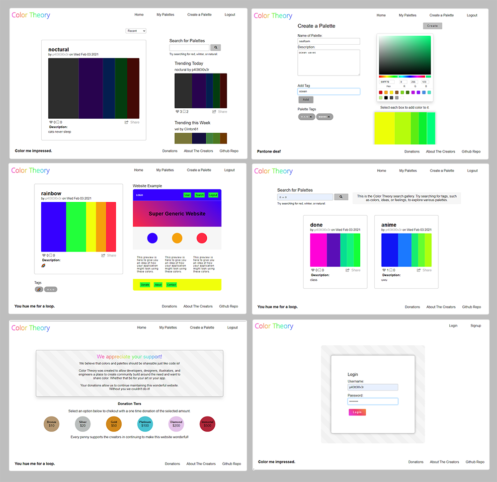

___

# Color Theory - MERN Stack Application 🎨

[](https://opensource.org/licenses/MIT)
<!-- this has clickability and will go to the legalese -->


<p align='center'>


</p>

## Description
This is a community-sharing and creativity application that was developed to provide designers, developers, illustrators, and others a place to browse, create, and share the colors that inspire them.  Users have the ability to visualize their ideas immediately by creating palette schemes that display to a sample webpage.  Users enjoy a community experience through the "liking" and saving of other users' palettes.  This application is an interactive MERN stack single-page application, focused on performance and efficiency, for meeting user demand.  The application was also designed with mobile-first at the forefront including the ability to access the application offline.  As a MERN stack, this application uses MongoDB for the database, Express.js for the server-side web framework, React.js for the client-side framework, and Node.js for the web server.  Apollo is used to create a GraphQL API.  Additionally, the application is a Progressive Web Application, including a web manifest for local installation and utilizes a service worker and IndexedDB for offline functionality.  The application also utilizes JSON Web Tokens for authentication.

<br/>


## Table of Contents
* [Deployed Application](#application)
* [Technology](#technology)
* [Installation](#installation)
* [Usage](#usage)
* [Contributing](#contributing)
* [Tests](#tests)
* [License](#license)
* [Screenshot](#screenshot)

## Application

[Click here for Color Theory deployed on Heroku!](https://color-theory.herokuapp.com/ "Color Theory")

## Technology

### New Technology:

#### [React-Color](https://casesandberg.github.io/react-color/) - Color-Pickering API

* an API that allows you to access colors as variables and control them with React's State

#### [chroma.js](https://www.npmjs.com/package/chroma-js) - A colorful JavaScript library

* a library for converting and manipulating color and color scales

### Other:

#### Backend

* if-env
* concurrently
* apollo-server-express
* bcrypt
* dotenv
* express
* jsonwebtoken
* mongoose
* stripe

#### Frontend

* @apollo/react-hooks
* @stripe/stripe-js
* apollo-boost
* chroma-js
* graphql
* jwt-decode
* react
* react-dom
* react-redux
* react-router-dom
* redux
* web-vitals

### Other
* Adobe Photoshop


## Installation
The code of the application can be installed as follows: 

1. Clone the application's respository from GitHub onto your local drive.  The GitHub URL is: https://github.com/reynolkb/color-theory-1.0.

2. Set up the ```npm``` package by running the following command in the root directory, the client directory, and the server directory of the application: 
    
    ```
    npm install
    ```
    
    This will download the application's dependencies into the respective directories.
3. A ```.gitignore``` file should be created to include:
    ```
    node_modules
    .env
    .DS_Store
    ```
    if you intend to push your code to a repository.

## Usage

1.  Once code installation is complete, run the application by typing the following into the command line at the root directory of the application:

    ```
    npm start
    ```
    
    The server will start and open your browser to the application page at http://localhost:3000/.    

2.  The live version of the application: [Color Theory](https://color-theory.herokuapp.com/ "Color Theory")

Functionality includes sign-up, log-in, homepage of user palettes, create-palette, user page, and logging out.    

## Contributing

This application was built by:

### Gino Maglaque 

[GitHub](https://github.com/ginomaglaqueucla/) - ginomaglaque@gmail.com

* Project Managment
* Backend Engineer
* Backend Routes and Models


### Kyle Reynolds

[GitHub](https://github.com/reynolkb) - kyle.reynolds9146@gmail.com

* Backend Engineer
* MongoDB Management
* Query and Mutation setup
* Service Worker

### Cat Lin (Caitlin) Morgan 

[GitHub](https://github.com/cat-lin-morgan/) - plummorgan@gmail.com

* Lead Designer & Branding
* Graphic Design
* Frontend Engineer
* CSS aesthetic and HTML structure
* Chroma.js
* React-Color API


### Jane Hsu

[GitHub](https://github.com/plainjane99) - jane99hsu@gmail.com

* Lead Frontend Engineer
* Homepage/Sidebar connection to back-end
* Global State functionality 
* IndexedDB functionality 

Please contact us regarding other improvements, questions, or comments you would like to make.

## Screenshot



## License
This application is covered under the MIT license.

___

___Thank you___